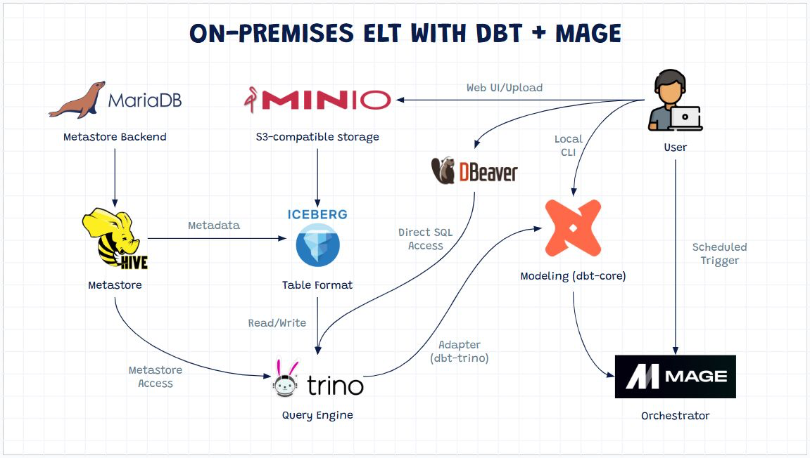

# NỘI DUNG YÊU CẦU CHO SLIDES
**Lưu ý: các nội dung chi tiết cụ thể cho từng slides, từng phần được lưu tại các files có đuôi .md tại tất cả các phần**

### Slide 1 (ngắn gọn): Tiêu đề & Bối cảnh
*   **Tiêu đề:** Tối ưu hóa Logistics dựa trên Big Data thời tiết và vận tải tại TP.HCM cho Startup Xe Dù (UDS).
*   **GitHub:** Chèn QR Code link GitHub góc màn hình
*   **Nội dung:**  (Rất ngắn gọn)
    - 1.1 Lý do chọn đề tài
    - 1.2 Business Task
    - Ngắn gọn, tập trung số liệu dẫn chứng. Ghi nguồn góc dưới

### Slide 2 (ngắn gọn): ASK
*   **Google Data Analytics**: liệt kê tên gọi 6 bước
*   **Trình bày 3 câu hỏi SMART:**

### Slide 3: PREPARE
Liệt kê các dữ liệu đầu vào + Nguồn dữ liệu

Vẽ sơ đồ Data Pipeline (có hình ảnh logo):
*   **Infrastructure:** Docker Compose (cluster orchestration), 
*   **Storage:** Hadoop HDFS (distributed storage)
*   **Processing & Analytics:** **Apache Spark** (PySpark, Spark SQL)
*   **Machine Learning:** **Spark MLlib** (ETA regression)
*   **Graph Processing (ACT):** **Spark GraphX** (flood-aware routing – future work)
*   **Streaming (Future):** Kafka + Spark Streaming
*   **Visualization:** Looker Studio / Power BI / Matplotlib

**Mẫu:**

### Slide 4 (ngắn gọn): PROCESS
*   **Công nghệ PySpark:** 
    - Liệt kê các bước đã làm: Kiểm tra: Trùng lặp, Giá trị null, Chuẩn hóa Đơn vị (mm, km, phút), Timezone về `Asia/Ho_Chi_Minh`
*   **Kỹ thuật Join/Merge:** Đảm bảo tất cả dữ liệu có thể **join theo `hour_timestamp`**
    - **Temporal Joining Key** (Làm tròn thời gian về giờ gần nhất - `hour_timestamp`).
*   **Schema-on-read:** Sử dụng `StructType` để định nghĩa cấu trúc dữ liệu nghiêm ngặt ngay khi đọc từ HDFS, đảm bảo tính nhất quán (Consistency).

### Slide 5: Mô hình ETA & Xử lý Train/Test trên HDFS (Q1 Analyze)
*   Chèn ảnh biểu đồ q1_eda
*   **Mô hình:** Linear Regression từ thư viện **Spark MLlib**.
*   **Kết quả:** chèn bảng 4.1 Tổng hợp RMSE qua các giai đoạn
*   Chèn ảnh biểu đồ q1_eta
*   Kết luận insights

### Slide 7: Dynamic Pricing - Câu chuyện thị trường (Q2 Analyze)
*   Chèn ảnh biểu đồ
*   **Nhấn mạnh:** thu nhập tài xế trong vùng ngập sụt giảm **~30%** (187 VND so với 266 VND/phút) .
*   Kết luận insights

### Slide 8: Phân tích không gian & Spark GraphX (Q3 Analyze)
*   Chèn biểu đồ q3 khi có
*   **Hiệu quả lộ trình:** Chứng minh dù quãng đường ngắn hơn nhưng thời gian lâu hơn trong vùng ngập (Hiệu suất giảm từ 88 xuống 61) .
*   Kết luận insights

### Slide 9: Chiến lược ACT - Từ Insights đến Prototype (Giai đoạn ACT)
*   **A1 - Dashboard ETA:** Tích hợp dự báo thời gian thực.
*   **A2 - Dynamic Pricing:** Tự động điều chỉnh thưởng tài xế, ưu đãi
*   **A3 - Smart Routing:** Tối ưu hóa đường đi điều hướng tránh điểm ngập.

### Slide 10: Định hướng dự án (Giai đoạn ACT)

## Limitations
*   Giải quyết 3 bài toán cùng lúc
*   Hạn chế dữ liệu để train model. không có GPS path, Q3 bị giới hạn

## Future work
*   Real-time pipeline (Kafka + Spark Streaming)
*   Graph-based routing (GraphX – Safe Path)
*   Design Thinking validation (user testing)
> Towards MVP System
